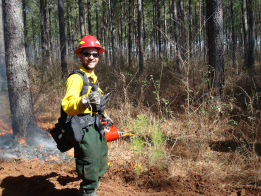

<!--
**rxdavim/rxdavim** is a ✨ _special_ ✨ repository because its `README.md` (this file) appears on your GitHub profile. -->

### Hi there 👋

:evergreen_tree: I am a Forestry and Natural Resources PhD student which main research interests are fire ecology and management with special focus on prescribed fire, fire behaviour and pyrogeography. My work is :moneybag: supported by FCT, and  :mailbox_closed: hosted at CEF/ISA, University of Lisbon.

:fire: I am a volunteer firefigher and certified for planning, preparing, executing and evaluating prescribed burning but also tactical fire operations. 

:computer: I am currently working on prescribed burning and wildfire interaction using diverse spatial data and statistical analysis to address fire-fuel relationships in Portugal.

Publications:

:writing_hand: **Davim, D.A.**, Rossa, C.G., Fernandes, P.M., 2021. Survival of prescribed burning treatmentsto wildfire in portugal. Forest Ecology and Management 493, 119250.https://doi.org/https://doi.org/10.1016/j.foreco.2021.119250

:writing_hand: Rossa, C.G., **Davim, D.A.**, Viegas, D.X., 2015. Behaviour of slope and wind backing fires. Inter-national Journal of Wildland Fire 24, 1085.https://doi.org/10.1071/wf14215 

:writing_hand: Viegas, D.X., Raposo, J.R., **Davim, D.A.**, Rossa, C.G., 2012. Study of the jump fire produced bythe interaction of two oblique fire fronts. Part 1. Analytical model and validation with no-slopelaboratory experiments. International Journal of Wildland Fire 21, 843.https://doi.org/10.1071/wf10155Montemor-o-Velho

